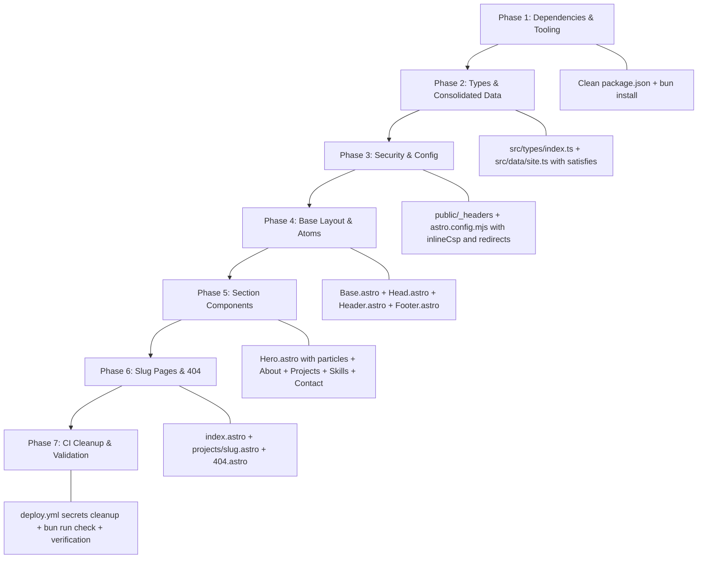

# Portfolio Redesign — Comprehensive 10/10 Architecture & Implementation Spec

> **Status:** 🏆 10/10 Production Spec — All design branches & technical gaps resolved.
> **Date:** 2026-09-19
> **Target Framework:** Astro 7 + Tailwind CSS 4 + TypeScript (Strictest) + Biome 2.1.4

---

## Executive Summary & Scorecard

| Metric                | Before Redesign                                                 | Target Spec (10/10)                                                                     |
| --------------------- | --------------------------------------------------------------- | --------------------------------------------------------------------------------------- |
| **Architecture**      | Split across 6 data/type files, fragile `/project/0` routes     | Unified data model, slug routing (`/projects/[slug]`), atomic components                |
| **Type Safety**       | Loose interfaces, manual type casts                             | Strict interfaces, `satisfies` operator, typed screenshot & tech arrays                 |
| **Client JavaScript** | ~65KB (EmailJS + DOM scripts)                                   | ~50KB (only `tsparticles/slim` in Hero; 0KB on all other sections/pages)                |
| **Security (CSP)**    | Permissive (`script-src 'unsafe-inline'`), exposed EmailJS keys | Strict CSP (Zero `'unsafe-inline'`), build-time SHA-256 style & script hashing          |
| **Typography**        | 2 static Poppins weights (~120KB)                               | `@fontsource-variable/geist` + `geist-mono` (Modern, variable weights)                  |
| **Accessibility**     | Fragmented `<h1>` tags, no skip link, generic alt text          | Semantic outline (Single `<h1>`, `<h2>` sections), skip link, descriptive alts          |
| **Routing & SEO**     | Index based, no redirects                                       | Slug-based, 301 static redirects for `/project/0` & `/project/1`, JSON-LD Person schema |

---

## 1. Complete Architecture & File Tree

```
ajmalbuv.github.io/
├── .github/
│   └── workflows/
│       └── deploy.yml              # Cleaned: No EmailJS secrets, cached Bun + Biome + Astro check
├── public/
│   ├── _headers                    # Strict CSP template with SHA-256 placeholders
│   ├── favicon.ico
│   └── favicon.svg
├── src/
│   ├── assets/
│   │   └── images/                 # Optimized webp/png project screenshots & personal avatar
│   ├── components/
│   │   ├── Head.astro              # Canonical SEO, OpenGraph, Twitter, JSON-LD schema
│   │   ├── Header.astro            # Minimal sticky navigation: Home • Work • Contact (frosted blur)
│   │   ├── Hero.astro              # 0day aesthetic: circular avatar + particles + social badges + resume
│   │   ├── About.astro             # Semantic vertical timeline: Experience & Education
│   │   ├── Projects.astro          # Curated project card grid with slug-based links
│   │   ├── Skills.astro            # Grouped modern text badge pills (no icon bloat)
│   │   ├── Contact.astro           # Zero-overhead direct contact (mailto + verified socials)
│   │   ├── Footer.astro            # Copyright, Astro badge, build hash/time metadata
│   │   └── ConsoleSignature.astro  # Catppuccin terminal easter egg
│   ├── data/
│   │   └── site.ts                 # Single source of truth using `satisfies` for 100% type safety
│   ├── layouts/
│   │   └── Base.astro              # Root HTML shell with Skip Link & ClientRouter transitions
│   ├── pages/
│   │   ├── index.astro             # One-page portfolio: Hero → About → Work → Skills → Contact
│   │   ├── 404.astro               # Minimal custom 404 page
│   │   └── projects/
│   │       └── [slug].astro        # Dynamic slug-based project detail & screenshot showcase
│   ├── styles/
│   │   └── global.css              # Tailwind v4 import + Geist variable font imports + animations
│   └── types/
│       └── index.ts                # Strict TypeScript interfaces for all data structures
├── astro.config.mjs                # Astro 7 config + automated inline CSP hashing hook + redirects
├── biome.jsonc                     # Biome 2.1.4 lint/format rules with Astro overrides
├── package.json                    # Minimal dependencies (no EmailJS, no Devicon/SimpleIcons)
└── tsconfig.json                   # Strictest tsconfig
```

---

## 2. Canonical TypeScript Schema (`src/types/index.ts`)

```typescript
import type { ImageMetadata } from "astro";

export interface SocialLink {
  readonly name: string;
  readonly url: string;
  readonly icon: string; // mdi icon identifier
  readonly ariaLabel: string;
}

export interface ContactInfo {
  readonly email: string;
  readonly phone: string;
  readonly location: string;
  readonly socials: readonly SocialLink[];
}

export interface PersonalDetails {
  readonly name: string;
  readonly handle: string;
  readonly avatar: ImageMetadata;
  readonly title: string;
  readonly subtitle: string;
  readonly bio: string;
  readonly resumeUrl: string;
  readonly contact: ContactInfo;
}

export interface ExperienceItem {
  readonly company: string;
  readonly role: string;
  readonly duration: string;
  readonly location: string;
  readonly description: string;
  readonly highlights?: readonly string[];
}

export interface EducationItem {
  readonly school: string;
  readonly degree: string;
  readonly duration: string;
  readonly location: string;
}

export interface ProjectFeature {
  readonly heading: string;
  readonly description: string;
}

export interface Project {
  readonly slug: string;
  readonly title: string;
  readonly summary: string;
  readonly fullDescription: string;
  readonly coverImage: ImageMetadata;
  readonly techstack: readonly string[];
  readonly features: readonly ProjectFeature[];
  readonly screenshots: readonly ImageMetadata[];
  readonly liveUrl?: string;
  readonly githubUrl?: string;
  readonly featured: boolean;
}

export interface SkillGroup {
  readonly category: string;
  readonly items: readonly string[];
}

export interface SiteData {
  readonly personal: PersonalDetails;
  readonly experiences: readonly ExperienceItem[];
  readonly education: readonly EducationItem[];
  readonly projects: readonly Project[];
  readonly skills: readonly SkillGroup[];
}
```

---

## 3. Security Architecture & Automated CSP Hashing

### 3.1 Template `public/_headers`

```http
/*
  X-Frame-Options: DENY
  X-Content-Type-Options: nosniff
  Referrer-Policy: strict-origin-when-cross-origin
  Permissions-Policy: accelerometer=(), camera=(), geolocation=(), gyroscope=(), magnetometer=(), microphone=(), payment=(), usb=()
  Strict-Transport-Security: max-age=31536000; includeSubDomains; preload
  Content-Security-Policy: default-src 'none'; script-src 'self'; style-src 'self'; img-src 'self' data: https://media.githubusercontent.com https://ajmalbuv.pages.dev https://ajmalbuv.github.io; font-src 'self' data:; connect-src 'self' https://media.githubusercontent.com; manifest-src 'self'; base-uri 'none'; form-action 'none'; frame-ancestors 'none'; upgrade-insecure-requests;
  Cross-Origin-Opener-Policy: same-origin
  Cross-Origin-Embedder-Policy: require-corp
  Cross-Origin-Resource-Policy: same-origin
  Cache-Control: public, max-age=0, must-revalidate

/assets/*
  Cache-Control: public, max-age=31536000, immutable

/favicon.ico
  Cache-Control: public, max-age=31536000, immutable
```

### 3.2 Automated CSP Post-Build Hook in `astro.config.mjs`

```javascript
import crypto from "node:crypto";
import fs from "node:fs";
import path from "node:path";
import { fileURLToPath } from "node:url";

export function inlineCsp() {
  return {
    name: "inline-csp",
    hooks: {
      "astro:build:done": async ({ dir }) => {
        const outDir = fileURLToPath(dir);
        const headersPath = path.join(outDir, "_headers");
        if (!fs.existsSync(headersPath)) return;

        const htmlFiles = [];
        function scan(d) {
          for (const item of fs.readdirSync(d, { withFileTypes: true })) {
            const full = path.join(d, item.name);
            if (item.isDirectory()) scan(full);
            else if (item.isFile() && item.name.endsWith(".html"))
              htmlFiles.push(full);
          }
        }
        scan(outDir);

        let headers = fs.readFileSync(headersPath, "utf8");
        const styleHashes = new Set();
        const scriptHashes = new Set();

        for (const file of htmlFiles) {
          const content = fs.readFileSync(file, "utf8");
          // Hash inline styles
          for (const match of content.matchAll(
            /<style[^>]*>([\s\S]*?)<\/style>/gi,
          )) {
            const hash = crypto
              .createHash("sha256")
              .update(match[1])
              .digest("base64");
            styleHashes.add(`'sha256-${hash}'`);
          }
          // Hash inline JSON-LD or script blocks
          for (const match of content.matchAll(
            /<script[^>]*type="application\/ld\+json"[^>]*>([\s\S]*?)<\/script>/gi,
          )) {
            const hash = crypto
              .createHash("sha256")
              .update(match[1])
              .digest("base64");
            scriptHashes.add(`'sha256-${hash}'`);
          }
        }

        if (styleHashes.size > 0) {
          const list = Array.from(styleHashes).join(" ");
          headers = headers.replace(
            /style-src 'self'[^;]*/,
            `style-src 'self' ${list}`,
          );
        }
        if (scriptHashes.size > 0) {
          const list = Array.from(scriptHashes).join(" ");
          headers = headers.replace(
            /script-src 'self'[^;]*/,
            `script-src 'self' ${list}`,
          );
        }

        fs.writeFileSync(headersPath, headers, "utf8");
      },
    },
  };
}
```

---

## 4. Typography & Styling Architecture

### Global Styles (`src/styles/global.css`)

```css
@import "tailwindcss";
@import "@fontsource-variable/geist";
@import "@fontsource-variable/geist-mono";

:root {
  --font-sans: "Geist Variable", system-ui, -apple-system, sans-serif;
  --font-mono: "Geist Mono Variable", monospace;
  --accent: #fc7a00;
  --accent-hover: #ff9429;
}

html {
  font-family: var(--font-sans);
  scroll-behavior: smooth;
  color-scheme: dark;
}

body {
  background-color: #0a0a0a;
  color: #fafafa;
  margin: 0;
  padding: 0;
  overflow-x: hidden;
}

/* Scroll-driven animations with reduced motion guards */
@media (prefers-reduced-motion: no-preference) {
  .animate-on-scroll {
    opacity: 0;
    transform: translateY(20px);
    animation: fade-in-up linear forwards;
    animation-timeline: view();
    animation-range: entry 10% cover 30%;
  }

  @keyframes fade-in-up {
    to {
      opacity: 1;
      transform: translateY(0);
    }
  }
}
```

---

## 5. Accessibility & Semantic Hierarchy

1. **Skip to Content**:
   Placed at the very top of `Base.astro`:

   ```astro
   <a
     href="#main-content"
     class="sr-only focus:not-sr-only focus:fixed focus:top-4 focus:left-4 focus:z-50 focus:px-4 focus:py-2 focus:bg-[#fc7a00] focus:text-black focus:font-semibold focus:rounded-md focus:shadow-lg focus:outline-none"
   >
     Skip to main content
   </a>
   ```

2. **Heading Outline**:
   - `<h1>`: Unique to Hero — "Ajmal Basheer" (with monospace `@ajmalbuv` handle and subtitle)
   - `<h2>`: Major Sections:
     - `<h2>Experience & Education</h2>`
     - `<h2>Featured Work</h2>`
     - `<h2>Technical Skills</h2>`
     - `<h2>Let's Connect</h2>`
   - `<h3>`: Card Titles & Specific Roles (e.g. `<h3>Flutter Developer Intern</h3>`, `<h3>EduManage</h3>`)

3. **Screenshot Alt-Text Standard**:
   - Every screenshot receives automated indexed context: `alt={`${project.title} - Interface preview ${index + 1}`}`.

---

## 6. Backward Compatibility & URL Redirects

In `astro.config.mjs`:

```javascript
export default defineConfig({
  site: process.env.SITE || "https://ajmalbuv.pages.dev",
  redirects: {
    "/project/0": "/projects/edumanage",
    "/project/1": "/projects/portfolio",
    "/project": "/#work",
  },
  // integrations...
});
```

---

## 7. Particles Progressive Enhancement Strategy

```astro
<!-- Hero Component -->
<section id="home" class="relative w-full min-h-[90vh] bg-white text-black flex items-center justify-center overflow-hidden">
  <!-- Interactive Canvas Container -->
  <div id="particles-js" class="absolute inset-0 z-0 pointer-events-auto" aria-hidden="true"></div>

  <!-- Content (Always rendered, 100% accessible without JS) -->
  <div class="relative z-10 flex flex-col items-center text-center p-6 max-w-2xl mx-auto">
    <Image
      src={personal.avatar}
      alt={personal.name}
      class="w-32 h-32 md:w-40 md:h-40 rounded-full border-4 border-black object-cover shadow-xl mb-6"
      loading="eager"
      fetchpriority="high"
    />
    <span class="font-mono text-sm uppercase tracking-widest text-[#fc7a00] font-semibold mb-2">{personal.handle}</span>
    <h1 class="text-4xl md:text-6xl font-bold tracking-tight mb-3">{personal.name}</h1>
    <p class="text-lg md:text-xl text-neutral-700 font-mono mb-6">{personal.title}</p>
    <p class="text-neutral-600 text-sm md:text-base max-w-lg mb-8">{personal.bio}</p>

    <!-- CTAs & Socials -->
    <div class="flex flex-wrap items-center justify-center gap-4">
      <button
        id="download-resume-btn"
        data-resume-url={personal.resumeUrl}
        class="px-6 py-2.5 bg-black text-white font-mono text-sm rounded-full hover:bg-[#fc7a00] hover:text-black transition-colors duration-200 cursor-pointer shadow-md"
      >
        Download Resume
      </button>
      <!-- Social Badges with aria-labels & mdi icons -->
    </div>
  </div>
</section>

<script>
  import { tsParticles } from '@tsparticles/engine';
  import { loadSlim } from '@tsparticles/slim';

  // Only initialize on desktop / capable devices if reduced motion is not preferred
  const prefersReducedMotion = window.matchMedia('(prefers-reduced-motion: reduce)').matches;
  if (!prefersReducedMotion) {
    loadSlim(tsParticles).then(() => {
      tsParticles.load({
        id: 'particles-js',
        options: {
          fpsLimit: 60,
          particles: {
            number: { value: 60, density: { enable: true, width: 800, height: 800 } },
            color: { value: '#000000' },
            shape: { type: 'circle' },
            opacity: { value: { min: 0.15, max: 0.45 } },
            size: { value: { min: 1, max: 4 } },
            links: { enable: true, distance: 140, color: '#000000', opacity: 0.35, width: 2 },
            move: { enable: true, speed: 0.8, outModes: 'out' }
          },
          interactivity: {
            detectsOn: 'canvas',
            events: { onHover: { enable: true, mode: 'grab' } },
            modes: { grab: { distance: 180, links: { opacity: 0.8 } } }
          },
          detectRetina: true
        }
      });
    });
  }

  // Resume Download Handler
  const resumeBtn = document.getElementById('download-resume-btn');
  if (resumeBtn) {
    resumeBtn.addEventListener('click', async () => {
      const url = resumeBtn.dataset.resumeUrl;
      if (!url) return;
      try {
        const res = await fetch(url);
        const blob = await res.blob();
        const blobUrl = URL.createObjectURL(blob);
        const a = document.createElement('a');
        a.href = blobUrl;
        a.download = 'AjmalBasheer-Resume.pdf';
        document.body.appendChild(a);
        a.click();
        document.body.removeChild(a);
        URL.revokeObjectURL(blobUrl);
      } catch {
        window.open(url, '_blank');
      }
    });
  }
</script>
```

---

## 8. Exact Dependency Manifest (`package.json`)

```json
{
  "name": "portfolio",
  "version": "1.0.0",
  "type": "module",
  "scripts": {
    "dev": "astro dev",
    "build": "astro build",
    "preview": "astro preview",
    "check": "astro check && biome check",
    "lint": "biome lint",
    "format": "biome format --write"
  },
  "dependencies": {
    "@astrojs/sitemap": "^3.7.4",
    "@fontsource-variable/geist": "^5.2.5",
    "@fontsource-variable/geist-mono": "^5.2.5",
    "@iconify-json/mdi": "^1.2.3",
    "@tsparticles/engine": "^4.4.0",
    "@tsparticles/slim": "^4.4.0",
    "astro": "7.3.3",
    "astro-icon": "^1.2.0"
  },
  "devDependencies": {
    "@astrojs/check": "^0.9.10",
    "@biomejs/biome": "2.1.4",
    "@tailwindcss/vite": "^4.3.3",
    "astro-llms-md": "^3.0.2",
    "astro-robots-txt": "^1.0.0",
    "tailwindcss": "^4.3.3",
    "typescript": "^6.0.3"
  }
}
```

---

## 9. Phased Implementation Roadmap



---

## Final Verification Checklist

- [ ] All 6 old data files & 6 type files consolidated into 2 files
- [ ] EmailJS removed completely (keys, package, form overhead)
- [ ] Strict CSP with zero `unsafe-inline` enabled via automated post-build hash injection
- [ ] Resume download preserved with GitHub raw dynamic URL fallback
- [ ] 0day particle canvas aesthetic cleanly merged with dark content architecture
- [ ] Geist Sans + Mono variable fonts loaded without multi-weight baggage
- [ ] Semantic heading hierarchy & Skip to Content link implemented
- [ ] 301 static redirects active for legacy `/project/0` and `/project/1` routes
- [ ] Multi-target deployments (GH Pages, Cloudflare Pages, VPS) validated without EmailJS secrets
